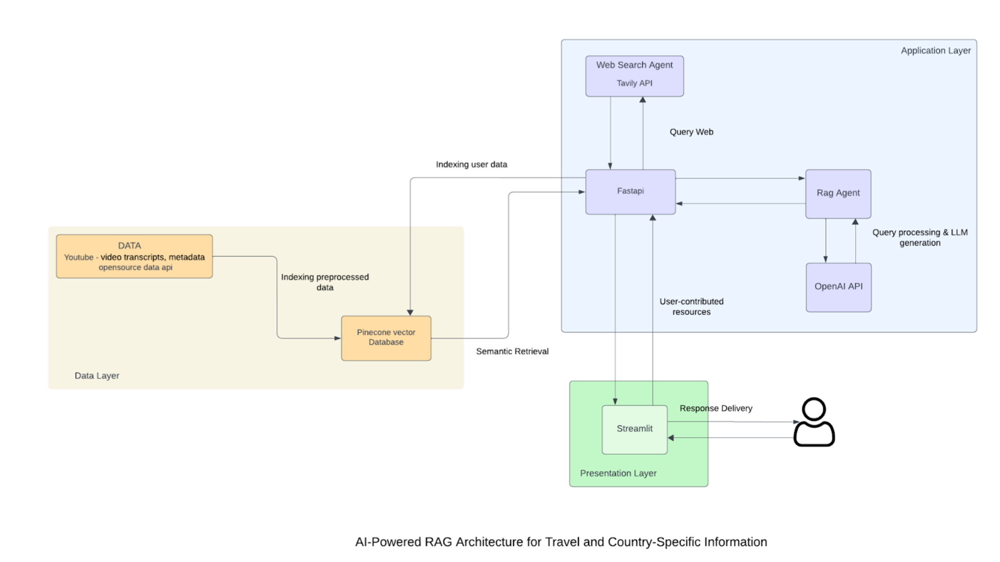

# TravelAI

## Intoduction
This project aims to develop a Multi-Modal Retrieval-Augmented Generation (RAG) application that assists users in personalized travel planning. By integrating a Large Language Model (LLM) with a Pinecone vector database and data sourced from the YouTube API, the system will retrieve, process, and present relevant travel information tailored to individual user preferences. The application will leverage an agent-based system comprising:
RAG Agent: Retrieves relevant information from the Pinecone vector database, populated with preprocessed data from YouTube videos and other sources.
Web Search Agent: Fetches real-time information from the web to complement database retrieval.
The final output will be an intelligent chatbot capable of providing personalized travel plans, recommendations, and real-time information.

